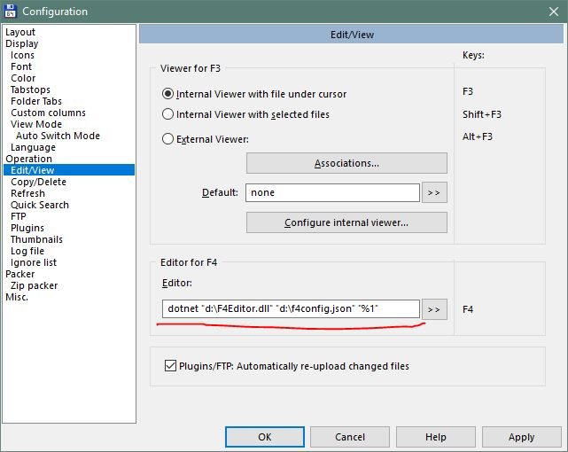

# Project summary

Convenience tool that selects most suitable program for Edit action  (traditionally triggered by F4 key) in Total Commander, instead of using the same editor for all files.

This is an alternative approach than using plugins like:
* F4Menu
* ChoiceEditor

which are unfortunately long unsupported and there's no version for 64-bit Total Commander.

# How it works?

You just need to set is as default editor in Total Commander, like in the screenshot.

Then if F4 is pressed, it will launch hidden and open your editor of choice (based on a configuration file).



# Configuration

Code below is an example of a configuration file content.

```json
{
  "DefaultEditor": {
    "EditorPath": "notepad.txt"
  },
  "EditorConfigurations": [
    {
      "EditorPath": "c:\\Program Files (x86)\\Microsoft VS Code\\Code.exe",
      "ExtensionList": "json;xml;html;htm;md"
    },
    {
      "EditorPath": "c:\\Program Files\\paint.net\\PaintDotNet.exe",
      "ExtensionList": "png;bmp;jpg;jpeg;gif"
    }
  ]
}
```

# How to install?

It's such a niche need that I don't expect anyone to need it and I didn't prepare any binary packages. Therefore, currently the code can only be used if it's manually compiled by the user.

If I'm wrong and you want to use such tool, drop me a message or create issue here, so I know there's need for it!

By default, it requires runtime for .NET Core 2.0 or newer installed, although it can be easily compiled as a [self-contained package](https://docs.microsoft.com/en-us/dotnet/core/deploying/) containing all required dependencies for a specific platform (eg. 64-bit Windows).

