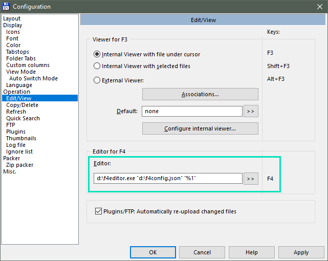

# Project summary

Convenience tool that selects most suitable program for Edit action  (traditionally triggered by F4 key) in Total Commander, instead of using the same editor for all files.

This is an alternative approach than using plugins like:
* F4Menu
* ChoiceEditor

which are unfortunately long unsupported and there's no version for 64-bit Total Commander.

# How it works?

You just need to set is as default editor in Total Commander, like in the screenshot.

Then if F4 is pressed, it will launch hidden and open your editor of choice (based on a configuration file).



# Configuration

Code below is an example of a configuration file content.

```json
{
  "DefaultEditor": {
    "EditorPath": "notepad.txt"
  },
  "EditorConfigurations": [
    {
      "EditorPath": "c:\\Program Files (x86)\\Microsoft VS Code\\Code.exe",
      "ExtensionList": "json;xml;html;htm;md"
    },
    {
      "EditorPath": "c:\\Program Files\\paint.net\\PaintDotNet.exe",
      "ExtensionList": "png;bmp;jpg;jpeg;gif"
    }
  ]
}
```

# Dependencies

Currently builds depend on .NET Framework 4.5. It's installed in your OS by default since Windows 8. In case of older systems, runtime can be manually installed, although it's likely that you already have it installed by Windows Update.
